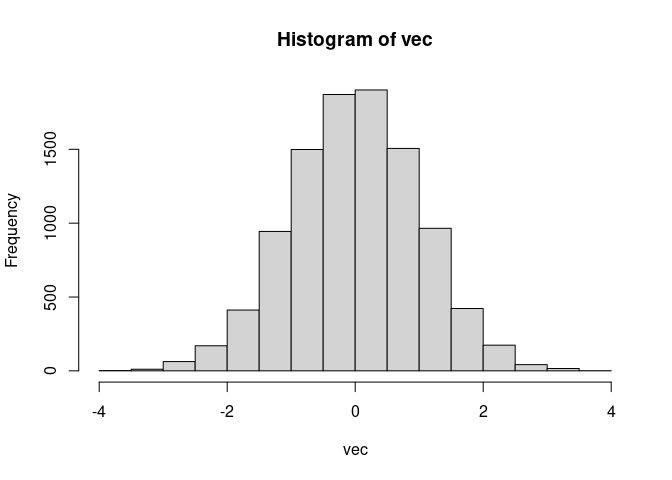

# Goal 1: Start an R Project on RStudio Server on CHPC

<https://ondemand.chpc.utah.edu/pun/sys/dashboard/batch_connect/sys/rstudio_server_app/session_contexts/new>

## Connect to RStudio Session

1.  Go to the onDemand RStudio Server url above.

2.  Enter the following information into the menu options:

    R version: **R 4.4.0 Geospatial packages** \#changed from R 4.0.3
    !  
    Cluster: notchpeak  
    Account and partition: usu-biol4750:notchpeak-shared-freecycle  
    Number of cores (per node): 4  
    Number of hours: 72  
    Memory per job in GB: 16

3.  Wait for a moment, and then click on “Connect to RStudio Server”

## Use the RStudio menu to connect to Git and start a Project

1.  File –&gt; New Project  
2.  Create Project –&gt; Version Control
3.  Create Project from Version Control –&gt; Git Repository URL:
    <https://github.com/saarman/usu-biol4750> Project directory name:
    usu-biol4750  
    Create project as a subdirectory of: ~/  
    Click on “Create Project”  
4.  In “Files” panel, select “lab01-NPS-example.md”  
5.  File –&gt; Save As…  
6.  Change the name to include your name or initials, and click “Save”  
7.  Occasionally, throughout the semester, you will want to “Pull” the
    master version of the class materials from the Git panel:  
    Click blue arrow for “Pull”  
8.  Optional steps include using Git to push your changes. This is
    optional becuase you will be turning in your work through Canvas,
    although… it would be neat and tidy to have everyone’s saved on Git!
    Click on the Commit  
    Select the files you want to upload to Git  
    Add a “commit” message  
    Click green arrow for “Push” NOTE: You will probably need to figure
    out Git account and login for this!

# Goal 2: Install Course R package

<https://bookdown.org/hhwagner1/LandGenCourse_book/how-to-use-this-book.html#course-r-package-landgencourse>

    if (!require("remotes")) install.packages("remotes")

    ## Loading required package: remotes

    remotes::install_github("hhwagner1/LandGenCourse")

    ## Using GitHub PAT from the git credential store.

    ## Skipping install of 'LandGenCourse' from a github remote, the SHA1 (af8af15d) has not changed since last install.
    ##   Use `force = TRUE` to force installation

    library(LandGenCourse)

Enter 1 when prompted.

## Any errors?

No errors, everyone is getting the package hhwagner1/LandGenCourse
installed.

Something I will need to run every single time:

    library(LandGenCourse)

# Goal 3: Review R Skills

<https://bookdown.org/hhwagner1/LandGenCourse_book/basic-r.html#basic-r>

    if(!requireNamespace("popgraph", quietly = TRUE))
    {
      install.packages(c("RgoogleMaps", "geosphere", "proto", "sampling", 
                          "seqinr", "spacetime", "spdep"), dependencies=TRUE)
      remotes::install_github("dyerlab/popgraph")
    }
    if(!requireNamespace("gstudio", quietly = TRUE)) remotes::install_github("dyerlab/gstudio")

    ## Warning: replacing previous import 'dplyr::union' by 'raster::union' when
    ## loading 'gstudio'

    ## Warning: replacing previous import 'dplyr::intersect' by 'raster::intersect'
    ## when loading 'gstudio'

    ## Warning: replacing previous import 'dplyr::select' by 'raster::select' when
    ## loading 'gstudio'

Here, I’m getting an error with gstudio. I’ll try with the remote
syntax, Still getting an error, referencing library( dplyr ). Can I load
dplyr beforehand? Nope… so I’m trying with the most up-to-date R 4.4.0
Geospatial packages

## Solution! Use **R 4.4.0 Geospatial packages during Goal 1**

Go back to the top, start over, making sure to select **“R 4.4.0
Geospatial packages”** Note change from 4.0.3

Then everything works, yay!

## Now going through exercises listed in Review R Skills

<https://bookdown.org/hhwagner1/LandGenCourse_book/basic-r.html#basic-r>

    variable <- 2

    class(variable)

    ## [1] "numeric"

    ?help

    vignette()

    x <- .3/3

    x

    ## [1] 0.1

    # Practice using the function print()
    print(x, digits = 20)

    ## [1] 0.099999999999999991673

    # [1] 0.099999999999999991673

    # Pactice using the function round()
    round(x, digits = 20)

    ## [1] 0.1

    # [1] 0.1

    vec <- rnorm(10000,mean = 0, sd = 1)

    hist(vec)

    ?round

    ## Help on topic 'round' was found in the following packages:
    ## 
    ##   Package               Library
    ##   base                  /usr/local/lib/R/library
    ##   terra                 /uufs/chpc.utah.edu/common/home/u6036559/R/library-ood-rocker-4.4
    ## 
    ## 
    ## Using the first match ...

    ?rnorm
