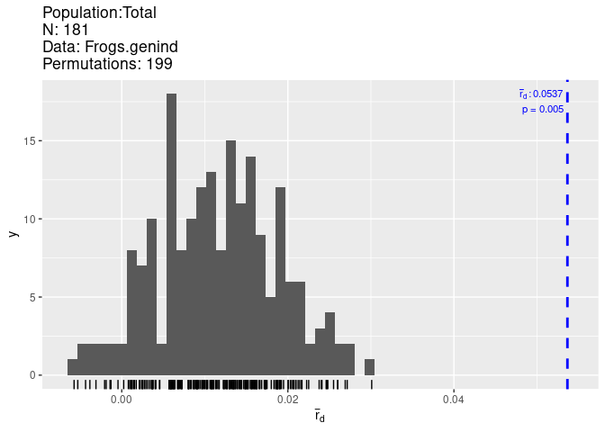
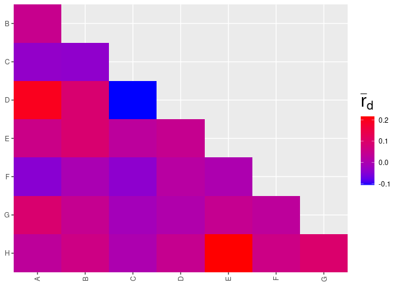
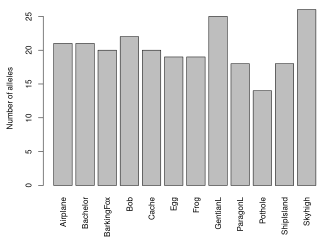
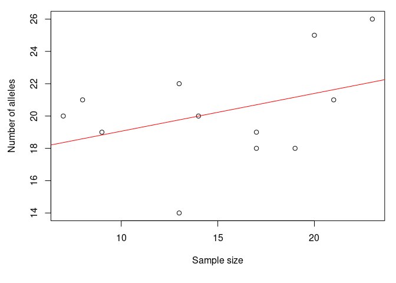
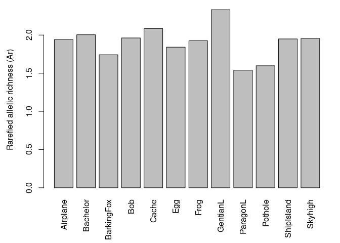
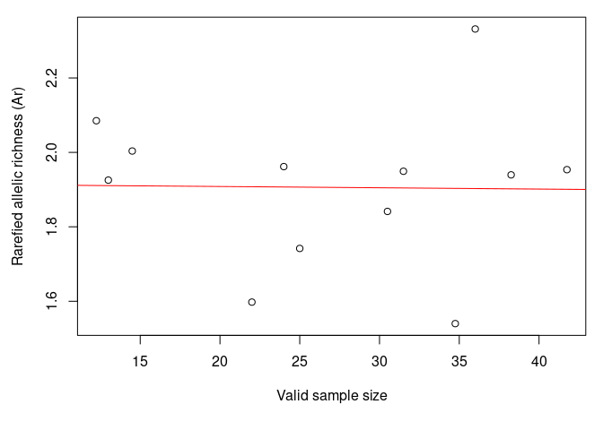
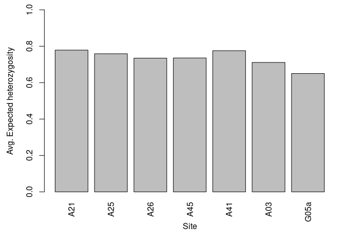
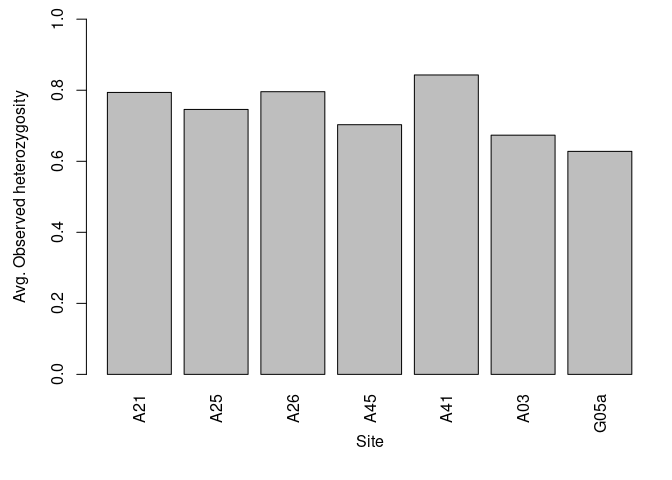

# Section 6.3 Worked Example

<https://bookdown.org/hhwagner1/LandGenCourse_book/WE_3.html>

Load libraries

    require(adegenet)
    require(LandGenCourse)
    require(pegas)       
    require(PopGenReport)
    require(dplyr)
    require(poppr) 
    require(here)

## 1. Overview

The data set we will use is ralu.loci

## 2. Import straight from the package after library is loaded

    data(ralu.loci, package="LandGenCourse")
    Frogs <- data.frame(FrogID = paste(substr(ralu.loci$Pop, 1, 3), 
                                       row.names(ralu.loci), sep="."), ralu.loci)
    Frogs.genind <- adegenet::df2genind(X=Frogs[,c(4:11)], sep=":", ncode=NULL, 
                              ind.names= Frogs$FrogID, loc.names=NULL, 
                              pop=Frogs$Pop, NA.char="NA", ploidy=2, 
                              type="codom", strata=NULL, hierarchy=NULL)
    Frogs.genind

    ## /// GENIND OBJECT /////////
    ## 
    ##  // 181 individuals; 8 loci; 39 alleles; size: 55.5 Kb
    ## 
    ##  // Basic content
    ##    @tab:  181 x 39 matrix of allele counts
    ##    @loc.n.all: number of alleles per locus (range: 3-9)
    ##    @loc.fac: locus factor for the 39 columns of @tab
    ##    @all.names: list of allele names for each locus
    ##    @ploidy: ploidy of each individual  (range: 2-2)
    ##    @type:  codom
    ##    @call: adegenet::df2genind(X = Frogs[, c(4:11)], sep = ":", ncode = NULL, 
    ##     ind.names = Frogs$FrogID, loc.names = NULL, pop = Frogs$Pop, 
    ##     NA.char = "NA", ploidy = 2, type = "codom", strata = NULL, 
    ##     hierarchy = NULL)
    ## 
    ##  // Optional content
    ##    @pop: population of each individual (group size range: 7-23)

Get info on genind object, check that they are polymorphic

    Frogs.genind

    ## /// GENIND OBJECT /////////
    ## 
    ##  // 181 individuals; 8 loci; 39 alleles; size: 55.5 Kb
    ## 
    ##  // Basic content
    ##    @tab:  181 x 39 matrix of allele counts
    ##    @loc.n.all: number of alleles per locus (range: 3-9)
    ##    @loc.fac: locus factor for the 39 columns of @tab
    ##    @all.names: list of allele names for each locus
    ##    @ploidy: ploidy of each individual  (range: 2-2)
    ##    @type:  codom
    ##    @call: adegenet::df2genind(X = Frogs[, c(4:11)], sep = ":", ncode = NULL, 
    ##     ind.names = Frogs$FrogID, loc.names = NULL, pop = Frogs$Pop, 
    ##     NA.char = "NA", ploidy = 2, type = "codom", strata = NULL, 
    ##     hierarchy = NULL)
    ## 
    ##  // Optional content
    ##    @pop: population of each individual (group size range: 7-23)

    summary(Frogs.genind)

    ## 
    ## // Number of individuals: 181
    ## // Group sizes: 21 8 14 13 7 17 9 20 19 13 17 23
    ## // Number of alleles per locus: 3 4 4 4 9 3 4 8
    ## // Number of alleles per group: 21 21 20 22 20 19 19 25 18 14 18 26
    ## // Percentage of missing data: 10.64 %
    ## // Observed heterozygosity: 0.1 0.4 0.09 0.36 0.68 0.02 0.38 0.68
    ## // Expected heterozygosity: 0.17 0.47 0.14 0.59 0.78 0.02 0.48 0.74

Test for HWE with pegas:

    round(pegas::hw.test(Frogs.genind, B = 1000), digits = 3)

    ##     chi^2 df Pr(chi^2 >) Pr.exact
    ## A  40.462  3       0.000    0.000
    ## B  17.135  6       0.009    0.024
    ## C 136.522  6       0.000    0.000
    ## D  83.338  6       0.000    0.000
    ## E 226.803 36       0.000    0.000
    ## F   0.024  3       0.999    1.000
    ## G  12.349  6       0.055    0.010
    ## H  76.813 28       0.000    0.000

    # Chi-squared test: p-value
    HWE.test <- data.frame(sapply(seppop(Frogs.genind), 
                                  function(ls) pegas::hw.test(ls, B=0)[,3]))
    HWE.test.chisq <- t(data.matrix(HWE.test))
    {cat("Chi-squared test (p-values):", "\n")
    round(HWE.test.chisq,3)}

    ## Chi-squared test (p-values):

    ##                A     B     C     D     E     F     G     H
    ## Airplane   0.092 0.359 1.000 0.427 0.680 1.000 0.178 0.051
    ## Bachelor   1.000 0.557 0.576 0.686 0.716 1.000 0.414 0.609
    ## BarkingFox 0.890 0.136 0.005 0.533 0.739 0.890 0.708 0.157
    ## Bob        0.764 0.864 0.362 0.764 0.033 1.000 0.860 0.287
    ## Cache      1.000 0.325 0.046 0.659 0.753 1.000 0.709 0.402
    ## Egg        1.000 0.812 1.000 1.000 0.156 1.000 0.477 0.470
    ## Frog       1.000 0.719 0.070 0.722 0.587 1.000 0.564 0.172
    ## GentianL   0.809 0.059 1.000 0.028 0.560 0.717 0.474 0.108
    ## ParagonL   1.000 0.054 0.885 0.709 0.868 1.000 0.291 0.000
    ## Pothole    1.000 1.000 1.000 0.488 0.248 1.000 0.296 0.850
    ## ShipIsland 0.807 0.497 1.000 0.521 0.006 1.000 0.498 0.403
    ## Skyhigh    0.915 0.493 0.063 0.001 0.155 1.000 0.126 0.078

    # Monte Carlo: p-value
    HWE.test <- data.frame(sapply(seppop(Frogs.genind), 
                                  function(ls) pegas::hw.test(ls, B=1000)[,4]))
    HWE.test.MC <- t(data.matrix(HWE.test))
    {cat("MC permuation test (p-values):", "\n")
    round(HWE.test.MC,3)}

    ## MC permuation test (p-values):

    ##               A     B     C     D     E F     G     H
    ## Airplane   0.02 1.000 1.000 0.391 0.638 1 0.254 0.014
    ## Bachelor   1.00 0.434 1.000 1.000 0.875 1 0.462 0.628
    ## BarkingFox 1.00 0.233 0.064 1.000 0.737 1 1.000 0.152
    ## Bob        1.00 1.000 1.000 1.000 0.014 1 1.000 0.242
    ## Cache      1.00 0.386 0.154 1.000 1.000 1 1.000 0.633
    ## Egg        1.00 1.000 1.000 1.000 0.091 1 0.519 0.399
    ## Frog       1.00 1.000 0.061 1.000 0.436 1 1.000 0.181
    ## GentianL   1.00 0.061 1.000 0.057 0.657 1 0.647 0.131
    ## ParagonL   1.00 0.182 1.000 1.000 1.000 1 0.315 0.057
    ## Pothole    1.00 1.000 1.000 1.000 0.537 1 0.526 1.000
    ## ShipIsland 1.00 0.629 1.000 0.685 0.135 1 0.566 0.439
    ## Skyhigh    1.00 0.369 0.193 0.093 0.092 1 0.075 0.024

    alpha=0.05 # /96
    Prop.loci.out.of.HWE <- data.frame(Chisq=apply(HWE.test.chisq<alpha, 2, mean), 
               MC=apply(HWE.test.MC<alpha, 2, mean))
    Prop.loci.out.of.HWE             # Type this line again to see results table

    ##        Chisq         MC
    ## A 0.00000000 0.08333333
    ## B 0.00000000 0.00000000
    ## C 0.16666667 0.00000000
    ## D 0.16666667 0.00000000
    ## E 0.16666667 0.08333333
    ## F 0.00000000 0.00000000
    ## G 0.00000000 0.00000000
    ## H 0.08333333 0.16666667

    Prop.pops.out.of.HWE <- data.frame(Chisq=apply(HWE.test.chisq<alpha, 1, mean), 
               MC=apply(HWE.test.MC<alpha, 1, mean))
    Prop.pops.out.of.HWE             

    ##            Chisq    MC
    ## Airplane   0.000 0.250
    ## Bachelor   0.000 0.000
    ## BarkingFox 0.125 0.000
    ## Bob        0.125 0.125
    ## Cache      0.125 0.000
    ## Egg        0.000 0.000
    ## Frog       0.000 0.000
    ## GentianL   0.125 0.000
    ## ParagonL   0.125 0.000
    ## Pothole    0.000 0.000
    ## ShipIsland 0.125 0.000
    ## Skyhigh    0.125 0.125

    Chisq.fdr <- matrix(p.adjust(HWE.test.chisq,method="fdr"), 
                        nrow=nrow(HWE.test.chisq))
    MC.fdr <- matrix(p.adjust(HWE.test.MC, method="fdr"), 
                        nrow=nrow(HWE.test.MC))

    Prop.pops.out.of.HWE <- data.frame(Chisq=apply(HWE.test.chisq<alpha, 1, mean), 
               MC=apply(HWE.test.MC<alpha, 1, mean),
               Chisq.fdr=apply(Chisq.fdr<alpha, 1, mean),
               MC.fdr=apply(MC.fdr<alpha, 1, mean))
    Prop.pops.out.of.HWE             

    ##            Chisq    MC Chisq.fdr MC.fdr
    ## Airplane   0.000 0.250     0.000      0
    ## Bachelor   0.000 0.000     0.000      0
    ## BarkingFox 0.125 0.000     0.000      0
    ## Bob        0.125 0.125     0.000      0
    ## Cache      0.125 0.000     0.000      0
    ## Egg        0.000 0.000     0.000      0
    ## Frog       0.000 0.000     0.000      0
    ## GentianL   0.125 0.000     0.000      0
    ## ParagonL   0.125 0.000     0.125      0
    ## Pothole    0.000 0.000     0.000      0
    ## ShipIsland 0.125 0.000     0.000      0
    ## Skyhigh    0.125 0.125     0.125      0

# Linkage Disequilibrium

    poppr::ia(Frogs.genind, sample=199)

    ##         Ia       p.Ia      rbarD       p.rD 
    ## 0.33744318 0.00500000 0.05366542 0.00500000

    LD.pair <- poppr::pair.ia(Frogs.genind)

    LD.pair

    ##          Ia   rbarD
    ## A:B  0.0485  0.0492
    ## A:C -0.0314 -0.0335
    ## A:D  0.1886  0.1966
    ## A:E  0.0560  0.0569
    ## A:F -0.0272 -0.0452
    ## A:G  0.0931  0.0935
    ## A:H  0.0294  0.0304
    ## B:C -0.0329 -0.0375
    ## B:D  0.0903  0.0911
    ## B:E  0.0910  0.0910
    ## B:F -0.0013 -0.0025
    ## B:G  0.0451  0.0452
    ## B:H  0.0621  0.0623
    ## C:D -0.0859 -0.1049
    ## C:E  0.0247  0.0284
    ## C:F -0.0311 -0.0397
    ## C:G -0.0107 -0.0118
    ## C:H  0.0012  0.0015
    ## D:E  0.0455  0.0458
    ## D:F  0.0094  0.0199
    ## D:G  0.0069  0.0070
    ## D:H  0.0461  0.0462
    ## E:F  0.0013  0.0025
    ## E:G  0.0453  0.0454
    ## E:H  0.2153  0.2159
    ## F:G  0.0167  0.0299
    ## F:H  0.0296  0.0606
    ## G:H  0.0942  0.0953

# Null Alleles

    # Null alleles: depends on method! See help file.
    Null.alleles <- PopGenReport::null.all(Frogs.genind)

# Genetic Diversity

## allelic richness

    Sum <- adegenet::summary(Frogs.genind)
    names(Sum)

    ## [1] "n"         "n.by.pop"  "loc.n.all" "pop.n.all" "NA.perc"   "Hobs"     
    ## [7] "Hexp"

    par(mar=c(5.5, 4.5,1,1))
    barplot(Sum$pop.n.all, las=3, 
           xlab = "", ylab = "Number of alleles")

    plot(Sum$n.by.pop, Sum$pop.n.all, 
           xlab = "Sample size", ylab = "Number of alleles")
    abline(lm(Sum$pop.n.all ~ Sum$n.by.pop), col = "red")

    Richness <- PopGenReport::allel.rich(Frogs.genind, min.alleles = NULL)
    Richness$alleles.sampled

    ## [1] 6

    par(mar=c(5.5, 4.5,1,1))
    barplot(Richness$mean.richness, las=3, ylab="Rarefied allelic richness (Ar)")

    plot(colMeans(Richness$pop.sizes), Richness$mean.richness,
         xlab="Valid sample size", 
         ylab="Rarefied allelic richness (Ar)")
    abline(lm(Richness$mean.richness ~ colMeans(Richness$pop.sizes)), col="red")

No longer correlated with sample size.  

# 6.4 Exercise

Task: Drop offspring (seeds, OffID==1) from dataset
pulsatilla\_genotypes.csv, check for HWE by site and locus and calculate
Hexp for each site.

## Drop offspring

Using adegenet and base R

    library(adegenet)

    # 1. CSV file "./downloads/pulsatilla_genotypes.csv" --> data frame 
    # with base R function read.csv()
    Flr <- read.csv("./downloads/pulsatilla_genotypes.csv", header=TRUE)

    # 2. Select only adults with base R indexing of data frame 
    # rows where OffID==0, all columns
    Flr <- Flr[Flr$OffID==0,]

    # 3. Combine columns with base R function paste()
    Flr <- data.frame(Flr[,1:5],loc1 = paste(Flr[,6],  Flr[,7], sep=":"), 
                                loc2 = paste(Flr[,8],  Flr[,9], sep=":"), 
                                loc3 = paste(Flr[,10], Flr[,11], sep=":"), 
                                loc4 = paste(Flr[,12], Flr[,13], sep=":"), 
                                loc5 = paste(Flr[,14], Flr[,15], sep=":"),  
                                loc6 = paste(Flr[,16], Flr[,17], sep=":"),  
                                loc7 = paste(Flr[,18], Flr[,19], sep=":"))

    # 4. Create genind object with "adegenet" function df2genind() 
    # using NA.char = "NA"
    Flr.genind <- df2genind(X=Flr[,c(6:12)], sep=":", ncode=NULL, ind.names= Flr$ID, loc.names=names(Flr[,c(6:12)]), pop=Flr$Population, NA.char="NA", ploidy=2, type="codom", strata=NULL, hierarchy=NULL)

    # 5. Check genind object
    Flr.genind

    ## /// GENIND OBJECT /////////
    ## 
    ##  // 221 individuals; 7 loci; 105 alleles; size: 130.8 Kb
    ## 
    ##  // Basic content
    ##    @tab:  221 x 105 matrix of allele counts
    ##    @loc.n.all: number of alleles per locus (range: 8-25)
    ##    @loc.fac: locus factor for the 105 columns of @tab
    ##    @all.names: list of allele names for each locus
    ##    @ploidy: ploidy of each individual  (range: 2-2)
    ##    @type:  codom
    ##    @call: df2genind(X = Flr[, c(6:12)], sep = ":", ncode = NULL, ind.names = Flr$ID, 
    ##     loc.names = names(Flr[, c(6:12)]), pop = Flr$Population, 
    ##     NA.char = "NA", ploidy = 2, type = "codom", strata = NULL, 
    ##     hierarchy = NULL)
    ## 
    ##  // Optional content
    ##    @pop: population of each individual (group size range: 14-56)

    summary(Flr.genind)

    ## 
    ## // Number of individuals: 221
    ## // Group sizes: 21 56 21 22 14 42 45
    ## // Number of alleles per locus: 18 8 25 8 19 14 13
    ## // Number of alleles per group: 63 68 54 50 51 73 53
    ## // Percentage of missing data: 0.9 %
    ## // Observed heterozygosity: 0.74 0.54 0.89 0.71 0.74 0.68 0.74
    ## // Expected heterozygosity: 0.83 0.57 0.89 0.74 0.81 0.76 0.83

# Count the number of individuals in each pop

    table(Flr$Population)

    ## 
    ##  A03  A21  A25  A26  A41  A45 G05a 
    ##   42   21   56   21   14   22   45

## With Gstudio this time

    library(gstudio)

    ## Warning: replacing previous import 'dplyr::union' by 'raster::union' when
    ## loading 'gstudio'

    ## Warning: replacing previous import 'dplyr::intersect' by 'raster::intersect'
    ## when loading 'gstudio'

    ## Warning: replacing previous import 'dplyr::select' by 'raster::select' when
    ## loading 'gstudio'

    ## Registered S3 method overwritten by 'gstudio':
    ##   method      from    
    ##   print.locus genetics

    ## 
    ## Attaching package: 'gstudio'

    ## The following object is masked from 'package:pegas':
    ## 
    ##     Fst

    ## The following objects are masked from 'package:adegenet':
    ## 
    ##     alleles, ploidy

    library(adegenet)

    # 1. CSV file "./downloads/pulsatilla_genotypes.csv" --> data frame 
    # with "gstudio" function read_population()
    g.Flr <- read_population("./downloads/pulsatilla_genotypes.csv",
                           type = "column",locus.columns = c(6:19))

    # 2. Select only adults with base R indexing of data frame 
    # rows where OffID==0, all columns
    g.Flr <- g.Flr[g.Flr$OffID==0,]

    # 3. Nothing to do here

    # 4. Create genind object with "adegenet" function df2genind() 
    # using NA.char = ""
    g.Flr.genind <- df2genind(X=g.Flr[,c(6:12)], sep=":", ncode=NULL, ind.names=g.Flr$ID, loc.names=NULL, pop=g.Flr$Population, NA.char="", ploidy=2, type="codom", strata=NULL, hierarchy=NULL)

    # 5. Check genind object
    g.Flr.genind

    ## /// GENIND OBJECT /////////
    ## 
    ##  // 221 individuals; 7 loci; 105 alleles; size: 129.8 Kb
    ## 
    ##  // Basic content
    ##    @tab:  221 x 105 matrix of allele counts
    ##    @loc.n.all: number of alleles per locus (range: 8-25)
    ##    @loc.fac: locus factor for the 105 columns of @tab
    ##    @all.names: list of allele names for each locus
    ##    @ploidy: ploidy of each individual  (range: 2-2)
    ##    @type:  codom
    ##    @call: df2genind(X = g.Flr[, c(6:12)], sep = ":", ncode = NULL, ind.names = g.Flr$ID, 
    ##     loc.names = NULL, pop = g.Flr$Population, NA.char = "", ploidy = 2, 
    ##     type = "codom", strata = NULL, hierarchy = NULL)
    ## 
    ##  // Optional content
    ##    @pop: population of each individual (group size range: 14-56)

    summary(g.Flr.genind)

    ## 
    ## // Number of individuals: 221
    ## // Group sizes: 21 56 21 22 14 42 45
    ## // Number of alleles per locus: 18 8 25 8 19 14 13
    ## // Number of alleles per group: 63 68 54 50 51 73 53
    ## // Percentage of missing data: 0.9 %
    ## // Observed heterozygosity: 0.74 0.54 0.89 0.71 0.74 0.68 0.74
    ## // Expected heterozygosity: 0.83 0.57 0.89 0.74 0.81 0.76 0.83

## Check for HWE by site and locus and calculate Hexp for each site

Test for HWE with pegas by site

    # Chi-squared test: p-value
    HWE.test <- data.frame(sapply(seppop(g.Flr.genind), 
                                  function(ls) pegas::hw.test(ls, B=0)[,3]))
    HWE.test.chisq <- t(data.matrix(HWE.test))
    {cat("Chi-squared test (p-values):", "\n")
    round(HWE.test.chisq,3)}

    ## Chi-squared test (p-values):

    ##      loc1_a loc2_a loc3_a loc4_a loc5_a loc6_a loc7_a
    ## A21   0.296  0.730  0.555  0.457  0.068  0.858  0.530
    ## A25   0.069  0.992  0.404  0.076  0.018  0.930  0.587
    ## A26   0.000  0.576  0.998  0.508  0.846  0.180  0.354
    ## A45   0.983  0.828  0.442  0.178  0.359  0.120  0.244
    ## A41   0.586  0.733  0.179  0.038  0.468  0.956  0.717
    ## A03   1.000  0.193  0.040  0.047  0.000  0.970  0.490
    ## G05a  0.436  0.672  0.121  0.954  0.394  0.973  0.104

    # Monte Carlo: p-value
    HWE.test <- data.frame(sapply(seppop(g.Flr.genind), 
                                  function(ls) pegas::hw.test(ls, B=1000)[,4]))
    HWE.test.MC <- t(data.matrix(HWE.test))
    {cat("MC permuation test (p-values):", "\n")
    round(HWE.test.MC,3)}

    ## MC permuation test (p-values):

    ##      loc1_a loc2_a loc3_a loc4_a loc5_a loc6_a loc7_a
    ## A21   0.243  0.649  0.959  0.294  0.118  0.710  0.441
    ## A25   0.207  1.000  0.346  0.086  0.622  0.592  0.322
    ## A26   0.088  0.757  0.962  0.392  0.986  0.245  0.140
    ## A45   0.808  0.483  0.512  0.059  0.246  0.006  0.663
    ## A41   0.370  0.810  0.085  0.015  0.647  0.925  0.825
    ## A03   0.878  0.039  0.293  0.070  0.006  0.717  0.387
    ## G05a  0.119  0.552  0.011  0.968  0.152  0.397  0.178

    alpha=0.05 # /96
    Prop.loci.out.of.HWE <- data.frame(Chisq=apply(HWE.test.chisq<alpha, 2, mean), 
               MC=apply(HWE.test.MC<alpha, 2, mean))
    Prop.loci.out.of.HWE             # Type this line again to see results table

    ##            Chisq        MC
    ## loc1_a 0.1428571 0.0000000
    ## loc2_a 0.0000000 0.1428571
    ## loc3_a 0.1428571 0.1428571
    ## loc4_a 0.2857143 0.1428571
    ## loc5_a 0.2857143 0.1428571
    ## loc6_a 0.0000000 0.1428571
    ## loc7_a 0.0000000 0.0000000

    Prop.pops.out.of.HWE <- data.frame(Chisq=apply(HWE.test.chisq<alpha, 1, mean), 
               MC=apply(HWE.test.MC<alpha, 1, mean))
    Prop.pops.out.of.HWE             

    ##          Chisq        MC
    ## A21  0.0000000 0.0000000
    ## A25  0.1428571 0.0000000
    ## A26  0.1428571 0.0000000
    ## A45  0.0000000 0.1428571
    ## A41  0.1428571 0.1428571
    ## A03  0.4285714 0.2857143
    ## G05a 0.0000000 0.1428571

    Chisq.fdr <- matrix(p.adjust(HWE.test.chisq,method="fdr"), 
                        nrow=nrow(HWE.test.chisq))
    MC.fdr <- matrix(p.adjust(HWE.test.MC, method="fdr"), 
                        nrow=nrow(HWE.test.MC))

    Prop.pops.out.of.HWE <- data.frame(Chisq=apply(HWE.test.chisq<alpha, 1, mean), 
               MC=apply(HWE.test.MC<alpha, 1, mean),
               Chisq.fdr=apply(Chisq.fdr<alpha, 1, mean),
               MC.fdr=apply(MC.fdr<alpha, 1, mean))
    Prop.pops.out.of.HWE   

    ##          Chisq        MC Chisq.fdr MC.fdr
    ## A21  0.0000000 0.0000000 0.0000000      0
    ## A25  0.1428571 0.0000000 0.0000000      0
    ## A26  0.1428571 0.0000000 0.1428571      0
    ## A45  0.0000000 0.1428571 0.0000000      0
    ## A41  0.1428571 0.1428571 0.0000000      0
    ## A03  0.4285714 0.2857143 0.1428571      0
    ## G05a 0.0000000 0.1428571 0.0000000      0

# Hexp for each site

    Hobs <- t(sapply(seppop(g.Flr.genind), function(ls) summary(ls)$Hobs))
    Hexp <- t(sapply(seppop(g.Flr.genind), function(ls) summary(ls)$Hexp))
    {cat("Expected heterozygosity (Hexp):", "\n")
    round(Hexp, 2)}

    ## Expected heterozygosity (Hexp):

    ##      loc1_a loc2_a loc3_a loc4_a loc5_a loc6_a loc7_a
    ## A21    0.82   0.59   0.92   0.74   0.81   0.73   0.83
    ## A25    0.87   0.59   0.87   0.70   0.64   0.77   0.86
    ## A26    0.56   0.65   0.78   0.81   0.76   0.80   0.78
    ## A45    0.78   0.56   0.86   0.67   0.73   0.74   0.80
    ## A41    0.76   0.68   0.77   0.81   0.82   0.77   0.83
    ## A03    0.67   0.60   0.89   0.58   0.85   0.67   0.72
    ## G05a   0.85   0.33   0.83   0.75   0.82   0.50   0.48

      par(mar=c(5.5, 4.5, 1, 1))
      Hobs.pop <- apply(Hobs, MARGIN = 1, FUN = mean)
      Hexp.pop <- apply(Hexp, 1, mean) 
      barplot(Hexp.pop, ylim=c(0,1), las=3, ylab="Avg. Expected heterozygosity", xlab = "Site")

      barplot(Hobs.pop, ylim=c(0,1), las=3, ylab="Avg. Observed heterozygosity", xlab = "Site")

Data frame of summary statistics

    Sum <- summary(g.Flr.genind)
    H.pop <- data.frame(Pop = names(Hobs.pop),
                        n = Sum[2]$n.by.pop,
                                  Hobs = Hobs.pop,
                                  Hexp = Hexp.pop)
    H.pop

    ##       Pop  n      Hobs      Hexp
    ## A21   A21 21 0.7938776 0.7787476
    ## A25   A25 56 0.7459098 0.7587271
    ## A26   A26 21 0.7959184 0.7346939
    ## A45   A45 22 0.7029375 0.7356625
    ## A41   A41 14 0.8430141 0.7756482
    ## A03   A03 42 0.6734694 0.7110058
    ## G05a G05a 45 0.6279942 0.6503175

Save “H.pop” for later in output file (eval = FALSE so that it doesn’t
do this every time I knit)

    saveRDS(H.pop, file = "./output/H.pop.rds")

## Question: Which site had the lowest expected heterozygosity?

Site G05a had the lowest average expected heterozygosity, at 0.6503175.
