# Section 5.4 Exercise

<https://bookdown.org/hhwagner1/LandGenCourse_book/r-exercise-week-2.html>

## a. Load libraries

    require(adegenet)
    require(LandGenCourse)
    require(gstudio)       
    require(dplyr)
    require(tibble) 
    require(sf)

## b. Import data with gstudio

First downloading the data

    if(!dir.exists(paste0(here(),"/downloads"))) dir.create(paste0(here(),"/downloads"))
    file.copy(system.file("extdata", "ralu.loci.csv", package = "LandGenCourse"),
              paste0(here(), "/downloads/ralu.loci.csv"), overwrite=FALSE)
    file.copy(system.file("extdata", "pulsatilla_genotypes.csv", package = "LandGenCourse"),
              paste0(here(), "/downloads/pulsatilla_genotypes.csv"), overwrite=FALSE)

Now loading the data with gstudio

    g.Flr <- read_population("./downloads/pulsatilla_genotypes.csv",type = "column",locus.columns = c(6:19))

    #g.Flr

## c. Summarize by site

I would probably just use the function table(), but we can see where
this takes us.

    table(g.Flr$Population) 

    ## 
    ##  A03  A21  A25  A26  A41  A45 G05a 
    ##   55   69  128   78   71   75   60

Recommend using groups\_by from library dplyr, with nested functions n
and summarize, and to Write the result into a new object Pulsatilla

summarize(nIndiv = n(g.Flr ))

Example from Worked example: pland\_sum\_b &lt;-
percentage\_forest\_500\_df %&gt;% dplyr::group\_by(plot\_id) %&gt;%
dplyr::summarize(sum\_pland = sum(value)) pland\_sum\_b

    puls_df <- g.Flr %>%                 # create a df and piping
      dplyr::group_by(Population) %>%    # grouping by population and piping
      dplyr::summarize(nIndiv = n())     # summarize with n() and add name of column "nIndiv"
    puls_df

    ## # A tibble: 7 × 2
    ##   Population nIndiv
    ##   <chr>       <int>
    ## 1 A03            55
    ## 2 A21            69
    ## 3 A25           128
    ## 4 A26            78
    ## 5 A41            71
    ## 6 A45            75
    ## 7 G05a           60

## d. Add mean X and Y coordinates to object Pulsatilla

summarize(nIndiv = n(), myMean = n(myVar))

    puls_df <- g.Flr %>%                 # create a df and piping
      dplyr::group_by(Population) %>%    # grouping by population and piping
      dplyr::summarize(nIndiv = n(), meanX = mean(X), meanY = mean(Y))     # summarize with n() and add name of column 
    puls_df

    ## # A tibble: 7 × 4
    ##   Population nIndiv    meanX    meanY
    ##   <chr>       <int>    <dbl>    <dbl>
    ## 1 A03            55 4431316. 5429358.
    ## 2 A21            69 4426927. 5427171.
    ## 3 A25           128 4422659. 5425365.
    ## 4 A26            78 4422710. 5425139.
    ## 5 A41            71 4426037. 5423339.
    ## 6 A45            75 4423091. 5427002.
    ## 7 G05a           60 4429202. 5434947.

    puls_df$meanX[2] == mean(g.Flr[g.Flr$Population == "A21",4])

    ## [1] TRUE

## e. Convert to sf object

    Sites <- as.data.frame(puls_df[,2:4])
    rownames(Sites) <- puls_df$Population
    colnames(Sites) <- c("n","X","Y")
    Pulsatilla <- st_as_sf(Sites, coords=c("X", "Y"))

## f. Specify the known projection

The correct EPSG number for this dataset is: 31468. You can specify the
CRS with:

    st_crs(Pulsatilla) <- 31468

    Pulsatilla

    ## Simple feature collection with 7 features and 1 field
    ## Geometry type: POINT
    ## Dimension:     XY
    ## Bounding box:  xmin: 4422659 ymin: 5423339 xmax: 4431316 ymax: 5434947
    ## Projected CRS: DHDN / 3-degree Gauss-Kruger zone 4
    ##        n                geometry
    ## A03   55 POINT (4431316 5429358)
    ## A21   69 POINT (4426927 5427171)
    ## A25  128 POINT (4422659 5425365)
    ## A26   78 POINT (4422710 5425139)
    ## A41   71 POINT (4426037 5423339)
    ## A45   75 POINT (4423091 5427002)
    ## G05a  60 POINT (4429202 5434947)

## g. Transform to lat/long projection

Adapt code from section 2.c to transform the projection to the “longlat”
coordinate system, and write it into an object Pulsatilla.longlat.

    st_transform(Pulsatilla, crs = 4326)

    ## Simple feature collection with 7 features and 1 field
    ## Geometry type: POINT
    ## Dimension:     XY
    ## Bounding box:  xmin: 10.94239 ymin: 48.943 xmax: 11.05991 ymax: 49.04774
    ## Geodetic CRS:  WGS 84
    ##        n                  geometry
    ## A03   55 POINT (11.05991 48.99773)
    ## A21   69 POINT (11.00034 48.97756)
    ## A25  128  POINT (10.94239 48.9608)
    ## A26   78 POINT (10.94312 48.95877)
    ## A41   71   POINT (10.98887 48.943)
    ## A45   75 POINT (10.94798 48.97558)
    ## G05a  60 POINT (11.03004 49.04774)

    Pulsatilla

    ## Simple feature collection with 7 features and 1 field
    ## Geometry type: POINT
    ## Dimension:     XY
    ## Bounding box:  xmin: 4422659 ymin: 5423339 xmax: 4431316 ymax: 5434947
    ## Projected CRS: DHDN / 3-degree Gauss-Kruger zone 4
    ##        n                geometry
    ## A03   55 POINT (4431316 5429358)
    ## A21   69 POINT (4426927 5427171)
    ## A25  128 POINT (4422659 5425365)
    ## A26   78 POINT (4422710 5425139)
    ## A41   71 POINT (4426037 5423339)
    ## A45   75 POINT (4423091 5427002)
    ## G05a  60 POINT (4429202 5434947)

    plot(Pulsatilla)

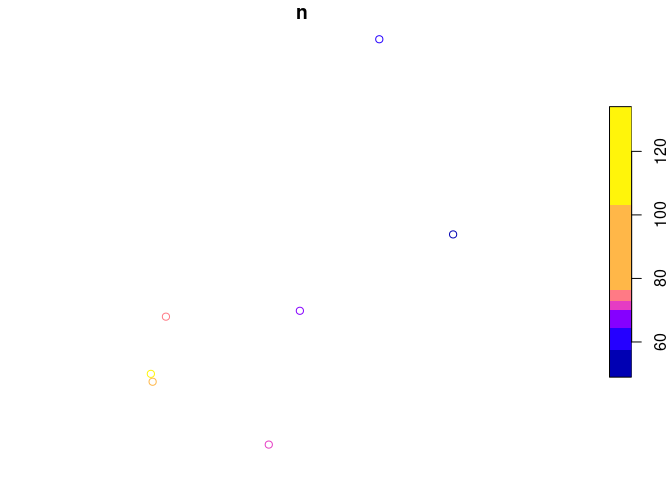
\## h. Create bubble plot Adapt code from section 4.d to create a bubble
plot of the number of individuals per population. Note: you may drop the
argument key.entries as it has a default.

Here it is in live view mode, i don’t need this in knitted output:

    library(tmap)
    tmap_mode("view")
    tm_shape(Pulsatilla) + tm_bubbles(col="n") 

Here it is again with plot mode so that I can have something in knitted
output

    library(tmap)

    ## Breaking News: tmap 3.x is retiring. Please test v4, e.g. with
    ## remotes::install_github('r-tmap/tmap')

    tmap_mode("plot")

    ## tmap mode set to plotting

    tm_shape(Pulsatilla) + tm_bubbles(col="n") 

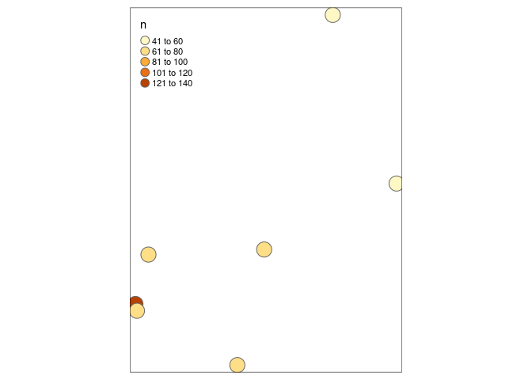

## i. Save data as R object

Save the object Pulsatilla.longlat as an R object using the following
code:

    saveRDS(Pulsatilla, file = "./output/Pulsatilla.longlat.rds")

We will need it for a later R exercise.

# BONUS material, working with ‘sf’ and ‘terra’

\##1. Load libraries, need to install GeNetIt

    library(LandGenCourse)
    library(sf)
    library(GeNetIt)

    ## Loading required package: nlme

    ## 
    ## Attaching package: 'nlme'

    ## The following object is masked from 'package:dplyr':
    ## 
    ##     collapse

    library(terra)

    ## terra 1.7.83

    library(tmap)
    library(dplyr)
    library(tibble)
    library(here)

    ## here() starts at /uufs/chpc.utah.edu/common/home/u6036559/git/usu-biol4750

\##2. import/export ESRI shape files a. Export ‘sf’ object to shapefile

    data(ralu.site)
    if(!dir.exists(here("output"))) dir.create(here("output"))
    dir.create(here("output/Sites"))

    ## Warning in dir.create(here("output/Sites")):
    ## '/uufs/chpc.utah.edu/common/home/u6036559/git/usu-biol4750/output/Sites'
    ## already exists

    st_write(ralu.site, here("output/Sites/Sites.shp"), delete_dsn = TRUE)

    ## Deleting source `/uufs/chpc.utah.edu/common/home/u6036559/git/usu-biol4750/output/Sites/Sites.shp' using driver `ESRI Shapefile'
    ## Writing layer `Sites' to data source 
    ##   `/uufs/chpc.utah.edu/common/home/u6036559/git/usu-biol4750/output/Sites/Sites.shp' using driver `ESRI Shapefile'
    ## Writing 31 features with 17 fields and geometry type Point.

1.  Import shapefile to ‘sf’ object

<!-- -->

    Sites.sf_a <- st_read(here("output/Sites/Sites.shp"))

    ## Reading layer `Sites' from data source 
    ##   `/uufs/chpc.utah.edu/common/home/u6036559/git/usu-biol4750/output/Sites/Sites.shp' 
    ##   using driver `ESRI Shapefile'
    ## Simple feature collection with 31 features and 17 fields
    ## Geometry type: POINT
    ## Dimension:     XY
    ## Bounding box:  xmin: 686908.5 ymin: 4994089 xmax: 690890.1 ymax: 5004435
    ## Projected CRS: NAD83 / UTM zone 11N

    Sites.sf_a 

    ## Simple feature collection with 31 features and 17 fields
    ## Geometry type: POINT
    ## Dimension:     XY
    ## Bounding box:  xmin: 686908.5 ymin: 4994089 xmax: 690890.1 ymax: 5004435
    ## Projected CRS: NAD83 / UTM zone 11N
    ## First 10 features:
    ##          SiteName        Drainage      Basin Substrate
    ## 1    AirplaneLake ShipIslandCreek Sheepeater      Silt
    ## 2  BachelorMeadow     WilsonCreek    Skyhigh      Silt
    ## 3  BarkingFoxLake  WaterfallCreek    Terrace      Silt
    ## 4    BirdbillLake      ClearCreek   Birdbill      Sand
    ## 5         BobLake     WilsonCreek     Harbor      Silt
    ## 6       CacheLake     WilsonCreek    Skyhigh      Silt
    ## 7         DoeLake     WilsonCreek    Skyhigh      Silt
    ## 8    EggWhiteLake     WilsonCreek    Skyhigh      Silt
    ## 9      ElenasLake ShipIslandCreek Sheepeater      Sand
    ## 10       FawnLake     WilsonCreek    Skyhigh      Silt
    ##                                NWI AREA_m2 PERI_m Depth_m  TDS FISH ACB   AUC
    ## 1                       Lacustrine 62582.2 1142.8   21.64  2.5    1   0 0.411
    ## 2  Riverine_Intermittent_Streambed   225.0   60.0    0.40  0.0    0   0 0.000
    ## 3                       Lacustrine 12000.0  435.0    5.00 13.8    1   0 0.300
    ## 4                       Lacustrine 12358.6  572.3    3.93  6.4    1   0 0.283
    ## 5                       Palustrine  4600.0  321.4    2.00 14.3    0   0 0.000
    ## 6                       Palustrine  2268.8  192.0    1.86 10.9    0   0 0.000
    ## 7                       Lacustrine 13034.9  463.2    6.03 10.0    1   0 0.415
    ## 8                       Palustrine  4544.5  291.9    3.30  2.4    0   0 0.000
    ## 9                       Palustrine     0.0    0.0    0.00  0.0    0   0 0.000
    ## 10                      Palustrine  3865.9  237.7    1.98  3.6    0   0 0.000
    ##     AUCV  AUCC   AUF AWOOD  AUFV                 geometry
    ## 1  0.000 0.411 0.063 0.063 0.464 POINT (688816.6 5003207)
    ## 2  0.000 0.000 1.000 0.000 0.000 POINT (688494.4 4999093)
    ## 3  0.000 0.300 0.700 0.000 0.000 POINT (687938.4 5000223)
    ## 4  0.000 0.283 0.717 0.000 0.000 POINT (689732.8 5002522)
    ## 5  0.000 0.000 0.500 0.000 0.500   POINT (690104 4999355)
    ## 6  0.000 0.000 0.556 0.093 0.352 POINT (688742.5 4997481)
    ## 7  0.171 0.585 0.341 0.000 0.073 POINT (688962.4 4996675)
    ## 8  0.047 0.047 0.686 0.209 0.058 POINT (688539.3 4998146)
    ## 9  0.000 0.000 0.000 0.000 0.000 POINT (688878.7 5004435)
    ## 10 0.000 0.000 1.000 0.000 0.000 POINT (688901.5 4996837)

    plot(Sites.sf_a)

    ## Warning: plotting the first 10 out of 17 attributes; use max.plot = 17 to plot
    ## all

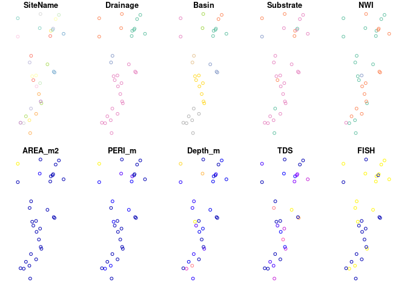
As sp

    data(ralu.site)
    Sites.sp <- sf::as_Spatial(ralu.site)
    Sites.sp

    ## class       : SpatialPointsDataFrame 
    ## features    : 31 
    ## extent      : 686908.5, 690890.1, 4994089, 5004435  (xmin, xmax, ymin, ymax)
    ## crs         : +proj=utm +zone=11 +datum=NAD83 +units=m +no_defs 
    ## variables   : 17
    ## names       :     SiteName,    Drainage,    Basin, Substrate,                                          NWI,  AREA_m2, PERI_m, Depth_m, TDS, FISH,  ACB,   AUC,  AUCV,  AUCC, AUF, ... 
    ## min values  : AirplaneLake,  ClearCreek, Birdbill,    Cobble,                                   Lacustrine,        0,      0,       0,   0,    0,    0,     0,     0,     0,   0, ... 
    ## max values  :  WelcomeLake, WilsonCreek,   TipTop,      Silt, Riverine_UpperPerennial_UnconsolidatedBottom, 353898.1, 4312.9,    24.3,  20,    1, 0.11, 0.817, 0.463, 0.817,   1, ...

Convert back to sf

    Sites.sf_b <- sf::st_as_sf(Sites.sp)
    Sites.sf_b

    ## Simple feature collection with 31 features and 17 fields
    ## Geometry type: POINT
    ## Dimension:     XY
    ## Bounding box:  xmin: 686908.5 ymin: 4994089 xmax: 690890.1 ymax: 5004435
    ## Projected CRS: +proj=utm +zone=11 +datum=NAD83 +units=m +no_defs
    ## First 10 features:
    ##          SiteName        Drainage      Basin Substrate
    ## 1    AirplaneLake ShipIslandCreek Sheepeater      Silt
    ## 2  BachelorMeadow     WilsonCreek    Skyhigh      Silt
    ## 3  BarkingFoxLake  WaterfallCreek    Terrace      Silt
    ## 4    BirdbillLake      ClearCreek   Birdbill      Sand
    ## 5         BobLake     WilsonCreek     Harbor      Silt
    ## 6       CacheLake     WilsonCreek    Skyhigh      Silt
    ## 7         DoeLake     WilsonCreek    Skyhigh      Silt
    ## 8    EggWhiteLake     WilsonCreek    Skyhigh      Silt
    ## 9      ElenasLake ShipIslandCreek Sheepeater      Sand
    ## 10       FawnLake     WilsonCreek    Skyhigh      Silt
    ##                                NWI AREA_m2 PERI_m Depth_m  TDS FISH ACB   AUC
    ## 1                       Lacustrine 62582.2 1142.8   21.64  2.5    1   0 0.411
    ## 2  Riverine_Intermittent_Streambed   225.0   60.0    0.40  0.0    0   0 0.000
    ## 3                       Lacustrine 12000.0  435.0    5.00 13.8    1   0 0.300
    ## 4                       Lacustrine 12358.6  572.3    3.93  6.4    1   0 0.283
    ## 5                       Palustrine  4600.0  321.4    2.00 14.3    0   0 0.000
    ## 6                       Palustrine  2268.8  192.0    1.86 10.9    0   0 0.000
    ## 7                       Lacustrine 13034.9  463.2    6.03 10.0    1   0 0.415
    ## 8                       Palustrine  4544.5  291.9    3.30  2.4    0   0 0.000
    ## 9                       Palustrine     0.0    0.0    0.00  0.0    0   0 0.000
    ## 10                      Palustrine  3865.9  237.7    1.98  3.6    0   0 0.000
    ##     AUCV  AUCC   AUF AWOOD  AUFV                 geometry
    ## 1  0.000 0.411 0.063 0.063 0.464 POINT (688816.6 5003207)
    ## 2  0.000 0.000 1.000 0.000 0.000 POINT (688494.4 4999093)
    ## 3  0.000 0.300 0.700 0.000 0.000 POINT (687938.4 5000223)
    ## 4  0.000 0.283 0.717 0.000 0.000 POINT (689732.8 5002522)
    ## 5  0.000 0.000 0.500 0.000 0.500   POINT (690104 4999355)
    ## 6  0.000 0.000 0.556 0.093 0.352 POINT (688742.5 4997481)
    ## 7  0.171 0.585 0.341 0.000 0.073 POINT (688962.4 4996675)
    ## 8  0.047 0.047 0.686 0.209 0.058 POINT (688539.3 4998146)
    ## 9  0.000 0.000 0.000 0.000 0.000 POINT (688878.7 5004435)
    ## 10 0.000 0.000 1.000 0.000 0.000 POINT (688901.5 4996837)

## b. Converting between terra and raster

    RasterMaps <- rast(system.file("extdata/covariates.tif", package="GeNetIt"))

    RasterMaps.r <- raster::stack(RasterMaps)
    RasterMaps.r 

    ## class      : RasterStack 
    ## dimensions : 426, 358, 152508, 6  (nrow, ncol, ncell, nlayers)
    ## resolution : 30, 30  (x, y)
    ## extent     : 683282.5, 694022.5, 4992833, 5005613  (xmin, xmax, ymin, ymax)
    ## crs        : +proj=utm +zone=11 +datum=NAD83 +units=m +no_defs 
    ## names      :          cti,        err27,          ffp,          gsp,          hli,         nlcd 
    ## min values : 8.429851e-01, 3.906551e-02, 0.000000e+00, 2.270000e+02, 1.014000e+03, 1.100000e+01 
    ## max values :   23.7147598,    0.7637643,   51.0000000,  338.0696716, 9263.0000000,   95.0000000

    plot(RasterMaps.r)

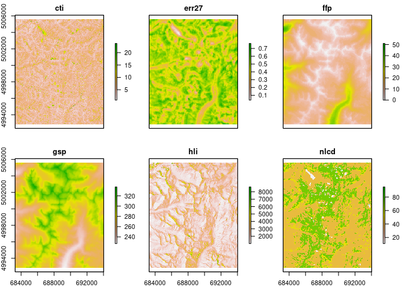
grab one layer

    gsp.r <- raster::raster(RasterMaps$gsp)
    gsp.r 

    ## class      : RasterLayer 
    ## band       : 4  (of  6  bands)
    ## dimensions : 426, 358, 152508  (nrow, ncol, ncell)
    ## resolution : 30, 30  (x, y)
    ## extent     : 683282.5, 694022.5, 4992833, 5005613  (xmin, xmax, ymin, ymax)
    ## crs        : +proj=utm +zone=11 +datum=NAD83 +units=m +no_defs 
    ## source     : covariates.tif 
    ## names      : gsp 
    ## values     : 227, 338.0697  (min, max)

    plot(gsp.r)

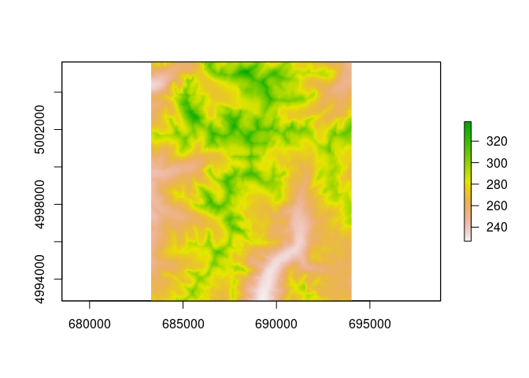
Convert to “terra”

    gsp <- terra::rast(gsp.r)
    gsp

    ## class       : SpatRaster 
    ## dimensions  : 426, 358, 1  (nrow, ncol, nlyr)
    ## resolution  : 30, 30  (x, y)
    ## extent      : 683282.5, 694022.5, 4992833, 5005613  (xmin, xmax, ymin, ymax)
    ## coord. ref. : +proj=utm +zone=11 +datum=NAD83 +units=m +no_defs 
    ## source      : covariates.tif 
    ## name        :      gsp 
    ## min value   : 227.0000 
    ## max value   : 338.0697

    plot(gsp)

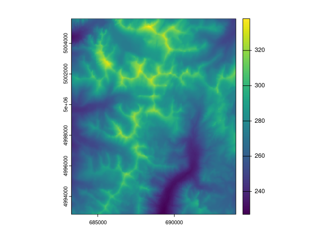

    plot(gsp.r)

    RasterMaps_b <- terra::rast(RasterMaps.r)
    RasterMaps_b

    ## class       : SpatRaster 
    ## dimensions  : 426, 358, 6  (nrow, ncol, nlyr)
    ## resolution  : 30, 30  (x, y)
    ## extent      : 683282.5, 694022.5, 4992833, 5005613  (xmin, xmax, ymin, ymax)
    ## coord. ref. : +proj=utm +zone=11 +datum=NAD83 +units=m +no_defs 
    ## source      : covariates.tif 
    ## names       :        cti,      err27, ffp,      gsp,  hli, nlcd 
    ## min values  :  0.8429851, 0.03906551,   0, 227.0000, 1014,   11 
    ## max values  : 23.7147598, 0.76376426,  51, 338.0697, 9263,   95

## 4. Plotting spatial data with tmap

1.  Plotting just the geometry from the data stored in sf object

<!-- -->

    data(ralu.site)
    Sites.sf_c <- ralu.site
    plot(st_geometry(Sites.sf_c))

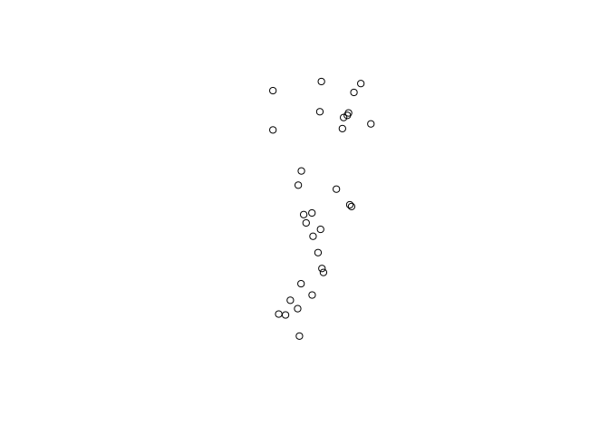
b. Plot the attributes

    par(mar=c(2,2,2,2))
    plot(Sites.sf_c, pch=16, cex=2)

    ## Warning: plotting the first 10 out of 17 attributes; use max.plot = 17 to plot
    ## all

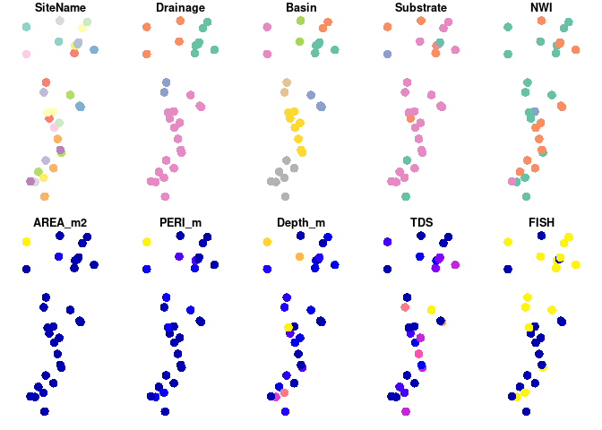

    plot(Sites.sf_c[,c("Basin", "Depth_m")], pch=16)

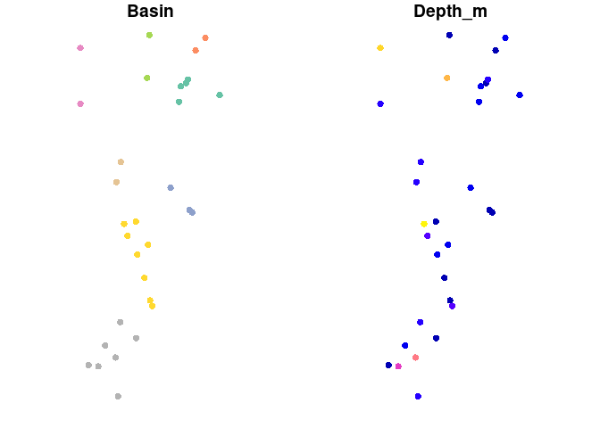

    plot(Sites.sf_c[,c(3,8)], pch=16)

1.  bubble plot with tmap library

<!-- -->

    tmap_mode("plot")

    ## tmap mode set to plotting

    tm_shape(Sites.sf_c) + tm_bubbles(size="Depth_m", col="Basin") +
      tm_layout(legend.outside=TRUE, legend.outside.position="right") 

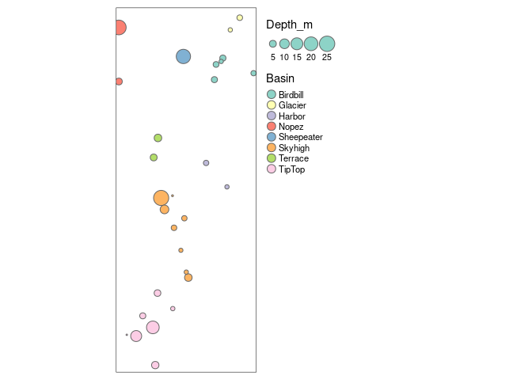
Extend extent of the plot

    Bbox = st_bbox(Sites.sf_c)
    Bbox

    ##      xmin      ymin      xmax      ymax 
    ##  686908.5 4994089.3  690890.1 5004435.0

    #expand this by a factor of 0.1
    delta.x <- Bbox[3] - Bbox[1]
    delta.y <- Bbox[4] - Bbox[2]
    Zoom <- 0.2
    Bbox2 <- Bbox + c(-delta.x, -delta.y, delta.x, delta.y) * Zoom
    Bbox2

    ##      xmin      ymin      xmax      ymax 
    ##  686112.2 4992020.2  691686.4 5006504.1

    tmap_mode("plot")

    ## tmap mode set to plotting

    Map1 <- tm_shape(Sites.sf_c, bbox=Bbox2) + 
      tm_bubbles(size="Depth_m", col="Basin") +
      tm_layout(legend.outside=TRUE, legend.outside.position="right") 
    Map1

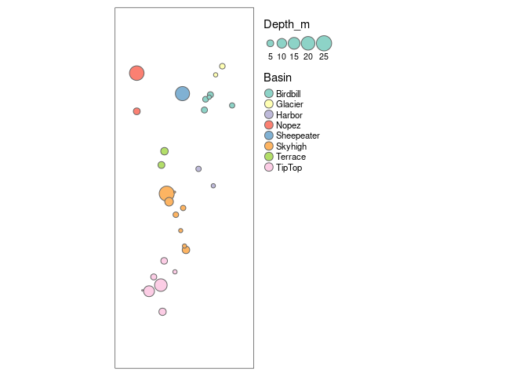
